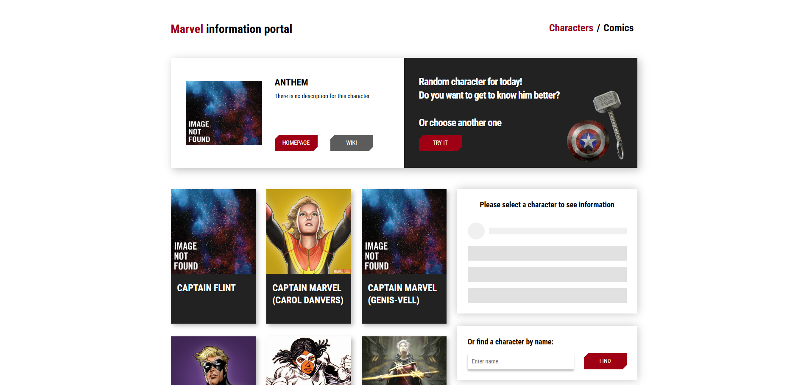

# Marvel Comics Explorer

This React-based web application allows users to explore Marvel comics and characters by fetching data from a remote API.

## Live Demo
You can view the live version of this app at:
https://neon-melomakarona-51819b.netlify.app/

## Features

- View Comic & Character Details: Get detailed information about specific Marvel comics and characters.
- Dynamic Character Loading: Load additional characters dynamically without refreshing the page.
- Search Functionality: Find characters by name.
- Page Navigation: Use React Router to seamlessly switch between different pages.


## Technologies Used

- React: JavaScript library for building user interfaces.
- JavaScript (ES6+): The core language used for app development.
- React Router: For client-side navigation.
- React Hooks: Used for state management and side effects (useState, useEffect, useCallback, useRef, useMemo ).
- CSS: For styling and layout of the application.
- npm: For managing dependencies and running build scripts.
- Node.js: The JavaScript runtime environment used for running the application locally.

## Installation

1. Clone the repository:
   ```bash
   https://github.com/yurazablotskiy/Marvel_comics.git
